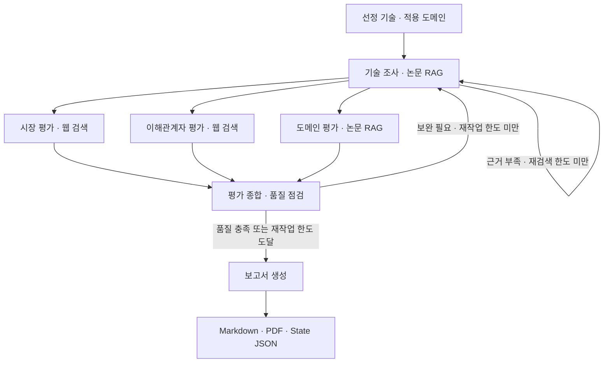

# Subject

KV cache 최적화 기술을 소프트웨어·하드웨어에서 각각 선정하고, 기술·시장·이해관계자·도메인 관점에서 비교 평가하는 **Agentic RAG** 프로젝트입니다. 논문과 웹 자료를 근거로 **데이터센터·클라우드 LLM 서빙** 환경의 적용 조건과 한계를 정리합니다.

## Overview

- **Objective**: 두 기술을 동일한 평가 관점으로 분석하고, 관점 간 일치점·상충점·불확실성을 도출합니다. 특정 기술의 우열이나 추천은 하지 않습니다.
- **Method**: Multi-Agent 병렬 평가 + Agentic RAG 기반 검색·재검색 + 품질 피드백에 따른 재작업.
- **Tools**: 논문 검색 도구(`paper_search`, FAISS), Tavily 웹 검색, Markdown·PDF 보고서 생성.
- **평가 기준일**: 2026-09-21. 이후의 사실은 반영하지 않습니다.

## Selected Domain

- **선정 도메인**: 데이터센터/클라우드 환경의 장문맥 LLM 질의응답 서빙
- **대표 시나리오**: 기업 내부의 긴 보고서와 기술 문서 묶음을 활용하는 다중 사용자 질의응답 서비스
- **선정 이유**: 장문맥과 동시 요청으로 발생하는 KV-cache 용량, 메모리 대역폭, 데이터 이동 병목이 뚜렷해 MLA의 저장량 절감과 CXL-PNM의 메모리 확장 효과를 성능, 비용, 전력, 운영 관점에서 함께 평가할 수 있습니다.

## Selected Technologies

- **SW — DeepSeek-V2 MLA (Multi-head Latent Attention)**: KV를 저차원 잠재 표현으로 저장하는 어텐션 구조입니다. 메모리 절감 효과와 모델·서빙 구조 변경에 따른 도입 부담을 함께 평가하기 위해 선정했습니다.
- **HW — CXL-PNM (CXL 기반 Processing-Near-Memory)**: CXL 메모리 근처에서 KV cache 관련 연산을 수행하는 구조입니다. 데이터 이동 감소 효과와 장치·시스템 구성 비용을 함께 평가하기 위해 선정했습니다.

두 기술은 같은 KV-cache 병목을 각각 **데이터 표현 구조**와 **연산 위치**를 바꿔 푸는 근본적 재설계입니다. 이 대칭성 때문에 같은 서비스 도메인에서 효과·비용·호환성·성숙도를 비교할 수 있습니다. 기술과 도메인은 사람이 확정했습니다(Human 기반 선정).

| 비교 항목 | DeepSeek MLA | CXL-PNM |
|---|---|---|
| 변경 계층 | 모델의 어텐션 구조 | 하드웨어의 메모리·연산 배치 |
| 직접 완화 대상 | KV-cache 저장량과 HBM 사용 | 외부 메모리 사용 시 데이터 이동과 GPU 병목 |
| 주요 도입 부담 | 모델 구조 변경과 지원 소프트웨어 | 전용 장치와 시스템 통합 |

## Features

- **논문 RAG**: 허용 문서 6편 126쪽(200쪽 한도)을 manifest로 관리합니다. PDF를 페이지·소절 단위로 추출·정제한 뒤 400토큰 이내로 청킹하고(청크 467개), 원본 확인이 필요한 16개를 제외한 451개를 BGE-M3 임베딩·FAISS로 색인합니다.
- **다관점 평가**: 기술 조사 결과를 바탕으로 시장·이해관계자·도메인 평가를 병렬로 수행합니다. 세 노드는 서로 다른 State 필드만 갱신하므로 reducer 없이 병렬 실행됩니다.
- **재검색·품질 피드백**: 기술 근거가 부족하면 **미충족 기술의 논문만** 수정 질의로 재검색합니다(기본 2회). 평가 종합은 보완할 항목을 `quality_feedback`으로 정리합니다.
- **출처 추적**: 근거 ID와 원문 발췌는 LLM이 아니라 **검색 결과에서 코드가 생성**합니다. 모든 주장은 실제로 수집한 근거 ID를 참조해야 하며, 알 수 없는 ID를 참조한 주장은 제외하거나 오류로 처리합니다. 미확인 항목은 한계로 남깁니다.
- **공개정보 기반 TRL**: TRL은 단계·범위, 기준일, 신뢰도, 미확인 조건을 담은 구조(`trl_assessment`)로 기록하며, 공식 인증이 아닌 추정임을 명시합니다.
- **확증 편향 방지 전략**
  - 시장·이해관계자 모듈은 모든 기준을 **긍정·부정 질의 쌍**으로 검색합니다. 한쪽 방향만 빈약하면 그 방향만 보강 검색하고, 그래도 한쪽 근거뿐이면 "일방적 근거"로 기록합니다.
  - 주장마다 사실·의견·전망(`claim_type`)과 직접·연관(`scope`)을 구분합니다. 주장과 근거에 기술 고유어가 없으면 연관 시장으로, 기준일 이후 연도·전망 표현이 있으면 전망으로 **코드가 교정**합니다.
  - 소셜미디어·개인 블로그만 인용한 근거는 시장성 판단에 세지 않고, 학술 자료만으로는 상용화·도입·투자를 판단하지 않습니다.
  - 근거가 부족하면 판단을 유보하고, 서로 다른 실험 조건의 수치를 직접 순위화하지 않습니다.
- **실측 기반 규칙 보강**: 실제 API 실측에서 LLM이 연관 시장 전망을 대상 기술의 사실로 쓰거나, 근거를 한꺼번에 붙이거나, 입력 문서의 수치를 무관한 근거에 붙이는 문제가 나타났습니다. 이를 칸(기술×기준) 단위 호출, 근거 개수 상한, 짧은 참조키, 코드 생성 요약 같은 규칙으로 막았습니다.
- **보고서 생성**: 관점별 평가·공개 정보 기반 TRL 추정·참고문헌을 Markdown과 PDF로 정리합니다.

## Tech Stack

| 구분 | 구성 |
|---|---|
| Language | Python 3.11–3.12 |
| Framework | LangGraph, LangChain |
| LLM / Generator | `gpt-4.1-mini` 기본값 (`OPENAI_MODEL`, 기술 조사는 `TECHNICAL_MODEL`) |
| LLM / Judge | 평가 종합의 `gpt-4.1-mini` 품질 점검. 별도 원문 대조 Judge는 미적용 |
| Retrieval | FAISS `IndexFlatIP`, cosine 유사도. 기술별(sw·hw) 인덱스와 공통 문서 인덱스를 합쳐 top-5. `needs_review` 청크는 기본 제외 |
| Retrieval Metrics | 임베딩 선정 실험(설계서 2.7): BGE-M3 dev Recall@5 75.0%·MRR@10 0.651, test Recall@5 83.3%·MRR@10 0.681 |
| Embedding | `BAAI/bge-m3` (1,024차원 dense, L2 정규화) — Sentence Transformers |
| Web Search | Tavily |
| Output | Markdown, PDF |

Retrieval Metrics는 초기 문서 2편·123청크와 한국어 질문 40개(답변 가능 36개를 dev·test 18개씩)로 측정한 값입니다. 현재 6편·451청크 통합 인덱스 기준으로는 다시 측정하지 않았습니다.

임베딩 모델은 같은 조건에서 3개 후보를 비교해 선정했습니다.

| 모델 | dev Recall@5 | MRR@10 | 질의 p50 |
|---|---|---|---|
| **BAAI/bge-m3 (채택)** | 75.0% | 0.651 | 17.2ms |
| Qwen3-Embedding-0.6B | 75.0% | 0.601 | 28.0ms |
| multilingual-e5-large-instruct | 58.3% | 0.414 | 19.6ms |

[임베딩·검색 안내](docs/EMBEDDING_PIPELINE.md)에서 입력 형식과 인덱스 공유 방법을 확인할 수 있습니다.

## Agents

| 에이전트 | 역할 | 근거 |
|---|---|---|
| 기술 조사 | 원리·성능·한계·TRL을 분석하고 부족한 근거를 재검색 (서브그래프) | 논문 RAG |
| 시장 평가 | 시장 규모·성장성, 상용화·채택, 생태계 평가 | Tavily + 기술 조사 근거 재인용 |
| 이해관계자 평가 | 경쟁 기술 진영, 도입사·개발자, 투자 업계의 반응과 이해관계 분석 | Tavily + 기술 조사 근거 재인용 |
| 도메인 평가 | 데이터센터·클라우드 서빙의 성능·비용·정확도·전력·확장성 평가 | 논문 RAG |
| 평가 종합 | 네 평가의 일치점·상충점·적용 조건·불확실성을 정리하고 품질 점검 | 선행 에이전트 결과 |
| 보고서 생성 | 평가 결과와 출처를 통합해 Markdown·PDF 보고서 작성 | 종합 결과와 인용 목록 |

시장·이해관계자 모듈의 근거 분류, 확증편향 방지 조치, 판단 유보 규칙은 [에이전트 안내](docs/MARKET_STAKEHOLDER_AGENT.md)를 참고하세요.

## Architecture

전체 흐름은 `service/agent/graph/agent.py`의 LangGraph 하나로 연결되며, `run_agent.py`로 실행합니다.



- 기술 재검색 한도는 기본 2회이며 서브그래프에 구현되어 있습니다. 평가 종합의 품질 피드백이 있으면 기술 조사부터 한 번 재작업하며, 두 번째 종합에서도 피드백이 남으면 보고서 생성 전에 종료합니다.
- 근거 부족은 `partial`과 한계로 남기고 진행합니다. 모델·도구 오류는 `error`로 기록하고 자동 무한 반복 없이 중단합니다.
- 품질 점검이 사실 정확성을 보증하는 것은 아닙니다.

## Directory Structure

```text
├── docs/                         # 원본 논문·모듈 안내·작업 기록
├── database/                     # 전처리 산출물 (pages·sections·chunks.jsonl, manifest.json), 임베딩 입력
├── config/                       # API·모델·검색 설정
├── ingest/
│   ├── preprocess/              # PDF 추출·정제·소절 파싱·청킹
│   └── embedding/               # chunks.jsonl 정규화·BGE-M3 임베딩·FAISS 인덱스 저장
├── artifacts/faiss/              # FAISS 인덱스·청크 본문·메타데이터 (저장소에서 공유)
├── service/
│   ├── agent/graph/             # 기술 조사 서브그래프
│   ├── agent/node/              # 기술 조사·시장·이해관계자·도메인 평가 노드
│   ├── agent/tavily/            # 웹 검색·질의 템플릿·근거 검증
│   ├── agent/synthesis/         # 평가 종합
│   ├── agent/report/            # 보고서 생성
│   ├── retrieval/               # 공통 논문 인덱스 로딩·검색
│   └── schema/                  # 공통 State와 결과 형식
├── tests/                       # 회귀 테스트와 검색 응답 fixture
├── scripts/                     # 실제 API 점검 스크립트
├── result/                      # 실행 결과 (state.json, report.md, report.pdf)
├── run_agent.py                 # 전체 그래프 실행 진입점
└── README.md
```

## Usage

Python 3.11–3.12와 `uv`가 필요합니다.

```bash
git clone https://github.com/chaeeunwang/kv-cache-agentic-rag.git
cd kv-cache-agentic-rag
uv sync
cp .env.example .env
```

`.env`에 `OPENAI_API_KEY`와 `TAVILY_API_KEY`를 입력합니다. 기술 조사 모델은 `service/agent/node/technical/model.py`의 `TECHNICAL_MODEL`, 다른 평가 모델은 `OPENAI_MODEL`로 설정합니다.

FAISS 인덱스(`artifacts/faiss/`)는 저장소에 포함되어 있어 별도 색인 없이 검색할 수 있습니다. 전처리 청크(`database/chunks.jsonl`)를 다시 만든 경우에만 인덱스를 재생성합니다. `needs_review=true` 청크는 기본적으로 제외되며, 원본 확인 뒤 `INCLUDE_REVIEW_CHUNKS=true`로 포함할 수 있습니다. 자세한 내용은 [임베딩·검색 안내](docs/EMBEDDING_PIPELINE.md)를 참고하세요.

```bash
uv run -m ingest.embedding.build_index
```

전체 그래프를 실행하면 `result/`에 `state.json`, `report.md`, `report.pdf`를 저장합니다. OpenAI·Tavily API 비용이 발생합니다.

```bash
uv run run_agent.py --max-technical-retries 2
```

모듈별 확인은 다음과 같습니다.

```bash
uv run pytest -q                                                              # 회귀 테스트 (외부 API 없음)
uv run check_domain.py                                                        # 도메인 평가 흐름 (Mock)
uv run python scripts/tavily_live_check.py --technology hw_01 --perspective market   # 시장·이해관계자 실측 (API 비용 발생)
```

## Contributors

- 박지원 : PDF Parsing, Preprocessing (추출·정제·소절 파싱·청킹·manifest)
- 문진영 : Embedding, Retrieval (BGE-M3 임베딩·FAISS 인덱스·공용 검색)
- 이중헌 : 기술 조사 Agent (논문 RAG 서브그래프·TRL 추정)
- 박현준 : 시장성·이해관계자 Agent (Tavily 검색·확증편향 방지·근거 검증 규칙), 발표
- 왕채은 : 도메인 평가 Agent (기준별 논문 RAG·근거 연결 검증)
- 강용현 : 평가 종합·보고서 Agent (품질 점검·Markdown/PDF 보고서)

## 평가 보고서 핵심 포인트

2026-09-22 전체 그래프 실행 보고서(`result/report.md`)의 요약입니다. 수치는 각 논문·자료의 조건에서 보고된 값이며, 서로 다른 자료의 배수 수치로 우열을 정하지 않습니다.

| 구분 | DeepSeek MLA (SW) | CXL-PNM (HW) |
|---|---|---|
| 기술 성숙도 | **TRL 4~6 (중간 확신)**. 7B 이하 모델·128K 문맥에서 MHA2MLA 전환으로 KV cache 92% 이상 절감, 성능 저하 약 1% | **TRL 4~6 (중간 확신)**. 최대 1M 토큰 프로토타입 실험실 평가, 처리량 최대 21.9배·에너지 효율 최대 60배 개선 보고 |
| 시장성 | 직접 매출·점유율 근거는 부족. 오픈소스 추론 엔진 지원과 후속 모델 적용 사례로 인접 시장의 성장 잠재성 확인 | 직접 채택은 초기 단계. CXL 메모리 풀링·컨트롤러 등 인접 시장의 고성장 전망과 반도체 기업의 투자·제품화 확인 |
| 이해관계자 | KV 캐시 압축·추론 효율화 수단으로 긍정 평가, 성능 저하와 대형 모델 미지원 우려 공존 | SK하이닉스·Marvell·XCENA 등이 개발 중. 소프트웨어 복잡성·도입 비용·생태계 미성숙이 장벽 |
| 도메인 적용 | 추가 하드웨어 없이 적용 가능하나 미세 조정과 추론 엔진 호환성 필요 | CXL 호환 장치·드라이버·런타임 등 인프라 투자 필요 |
| 핵심 미확인 사항 | 텐서 병렬 추론 미공개로 7B 초과 모델·생산 환경 검증 부족 | 대규모 데이터센터 통합·장기 확장성 미확인 |

- **공통 결론**: 두 기술 모두 KV-cache 병목 완화 효과는 확인되지만 **TRL 4~6의 실험실·프로토타입 단계**이며, 대형 모델 지원(MLA)과 상용 데이터센터 적용(PNM)이 불확실합니다.
- **상충점과 적용 조건**: MLA는 **소프트웨어만으로 즉시 적용**할 수 있는 대신 모델 전환·규모 제약이 있고, PNM은 **초장문맥 확장성**이 강점이지만 하드웨어 도입 난이도와 비용이 큽니다. "기존 모델을 전환할 수 있는가, 새 인프라를 도입할 수 있는가"에 따라 적합한 기술이 달라집니다.
- **시장성 판단**: 두 기술 모두 대상 기술 자체의 시장 근거는 부족해 직접 판단은 유보했고, 인접 시장(오픈소스 생태계, CXL 하드웨어 시장)의 근거만 확인했습니다.
- **후속 과제**: 실제 도입 사례와 대형 모델 검증 자료, 통합 비용·전력의 정량 비교를 확보한 뒤 재평가가 필요합니다.

## Lessons Learned
- **제한된 문서를 검색하는 실습에서는 인프라 복잡도를 줄이는 것이 중요했습니다.** 대상 문서가 최대 200페이지로 제한되어 있어, 별도의 PostgreSQL 서버와 pgvector 확장을 구성하고 접속을 관리하는 부담을 줄이고자 FAISS로 변경했습니다. Python 실행 환경에서 인덱스를 생성하고 검색할 수 있도록 구성했으며, langchain의 메타데이터 필터도 FAISS에 적합했습니다.
- **프롬프트 지시만으로는 규칙이 지켜지지 않았습니다.** 실측에서 LLM은 근거를 통째로 붙이고, 해시 ID를 잘못 옮기고, 입력의 다른 문서 수치를 가져왔습니다. 반드시 지켜야 하는 규칙은 코드 검증으로 옮겼습니다.
- **가짜 모델 테스트와 실제 실행은 다른 문제를 보여줍니다.** 단위 테스트가 통과한 뒤에도 실측에서 새 실패 유형이 나왔고, 녹화한 실제 응답을 재생하는 테스트로 비용 없이 재현했습니다.
- **LLM 입력은 줄일수록 근거가 정확해졌습니다.** 필요한 근거만 나눠 전달하자 주장과 근거의 대응이 분명해졌습니다.
- **공용 스키마는 먼저 합의하고 추가만 하도록 설계해야 합니다.** 확장 필드를 선택 필드와 기본값으로 만들어 다른 모듈 수정 없이 병합했습니다.
- **통합 점검이 없으면 main이 조용히 깨집니다.** 모듈 구조를 바꾼 뒤 삭제된 파일 import와 lockfile 불일치가 남았습니다. 병합 전 전체 테스트와 실행 점검이 필요합니다.
