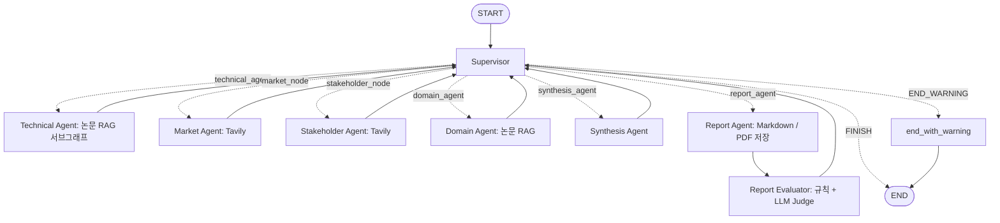
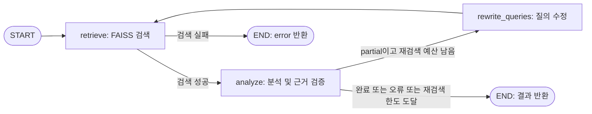

# Subject

본 프로젝트는 KV cache 최적화 기술을 소프트웨어/하드웨어에서 각각 선정하고, 기술/시장/이해관계자/도메인 관점에서 비교 평가하는 Agentic RAG 프로젝트입니다. 논문과 웹 자료를 근거로 데이터센터/클라우드 장문맥 LLM 질의응답 서빙 환경의 적용 조건과 한계를 정리합니다. 기술과 도메인은 사람이 확정했습니다.

## Overview

- Objective: 두 기술을 동일한 평가 관점으로 분석하고, 관점 간 일치점/상충점/불확실성을 도출합니다. 특정 기술의 우열이나 추천은 하지 않습니다.
- **Pattern**: Supervisor Pattern. 기술/시장/이해관계자/도메인별 전문 Agent를 두고, 중앙 Supervisor가 현재 State를 확인해 다음 실행 노드를 동적으로 선택합니다. 하위 Agent 간 직접 통신은 하지 않고 모든 작업 결과는 Supervisor로 반환합니다.
- **동적 처리**: Supervisor의 코드 규칙이 현재 State를 바탕으로 실행 후보와 기본값을 정하고, 후보가 여러 개일 때만 LLM이 후보 안에서 하나를 선택합니다. 최초 실행은 기술 → 시장 → 이해관계자 → 도메인 순서이며, 이후 근거 충분성과 품질 평가 결과에 따라 재작업 경로가 달라집니다. 하위 Agent는 순차 실행되며 작업 후 Supervisor로 돌아옵니다. 기술 조사 내부의 논문 재검색은 기본 2회, 보고서 FAIL 후 수정/재조사 경로 선택은 최대 1회입니다.
- **선정 도메인**: 데이터센터/클라우드 환경의 장문맥 LLM 질의응답 서빙. 기업 내부의 긴 보고서와 기술 문서 묶음을 활용하는 다중 사용자 서비스를 대표 시나리오로 삼습니다.
- **도메인 선정 이유**: 장문맥과 동시 요청으로 KV-cache 용량/메모리 대역폭/데이터 이동 병목이 뚜렷해, 두 기술의 효과를 성능/비용/전력/운영 관점에서 함께 평가할 수 있습니다.
- **평가 기준일**: 2026-09-21. 이후의 사실은 반영하지 않습니다.

## Selected Technologies

- **SW — DeepSeek-V2 MLA (Multi-head Latent Attention)**: Key와 Value를 저차원 잠재 표현으로 저장하는 어텐션 구조입니다. KV-cache 메모리 절감 효과와 모델/서빙 구조 변경에 따른 도입 부담을 함께 평가하기 위해 선정했습니다.
- **HW — CXL-PNM (CXL 기반 Processing-Near-Memory)**: CXL 메모리 근처에서 KV cache 관련 연산을 수행하는 구조입니다. 데이터 이동 감소 효과와 장치/시스템 구성 비용을 함께 평가하기 위해 선정했습니다.

두 기술은 같은 KV-cache 병목을 각각 데이터 표현 구조와 연산 위치를 바꿔 해결합니다. 이러한 대칭성을 바탕으로 같은 서비스 도메인에서 효과/비용/호환성/성숙도를 비교합니다.

## Features

- **PDF 자료 기반 논문 RAG**: 허용 문서 6편/126쪽을 manifest로 관리합니다. PDF를 페이지/소절 단위로 추출/정제한 뒤 400토큰 이내로 청킹합니다. 총 467개 청크 중 원본 확인이 필요한 16개를 제외한 451개를 임베딩/색인합니다.
- **Supervisor 기반 다관점 평가**: 기술/시장/이해관계자/도메인별 전문 Agent가 각 관점의 평가를 수행합니다. Supervisor는 현재 State를 확인해 필요한 Agent를 선택하고, 하위 Agent의 결과를 다시 전달받아 다음 경로를 결정합니다. 하위 Agent 간 직접 통신은 하지 않습니다.
- **재검색 및 출처 추적**: 기술 조사 내부에서 근거가 부족하면 해당 기술의 논문을 수정 질의로 재검색합니다. 근거 ID와 원문 발췌는 검색 결과에서 코드가 생성합니다. 기술/시장/이해관계자 노드에서는 참조를 검증하며, 보고서 평가에서는 네 관점 finding의 근거 ID와 본문 인용 ID를 다시 검사합니다. 도메인 노드 자체에는 같은 수준의 참조 ID 검증이 없으므로 후단 평가에서 확인합니다. 미확인 항목은 한계로 남깁니다.
- **공개 정보 기반 TRL 추정**: 단계/범위, 기준일, 신뢰도, 미확인 조건을 구조화해 기록하며, 공식 인증이 아닌 추정임을 명시합니다.
- **확증 편향 방지 전략**: 시장/이해관계자 평가의 모든 기준을 긍정/부정 질의 쌍으로 검색하고, 빈약한 방향만 보강 검색합니다. 사실/의견/전망과 직접/연관 근거를 구분하며, 소셜미디어/개인 블로그만으로 시장성을 판단하거나 학술 자료만으로 상용화/도입/투자를 판단하지 않습니다. 근거가 부족하면 판단을 유보하고, 서로 다른 실험 조건의 수치를 직접 순위화하지 않습니다.
- **보고서 품질 평가**: 생성된 보고서는 Hybrid 방식으로 평가합니다. Groundedness와 관점 커버리지는 규칙 기반 검사로 확인하고, 중립성과 편향 통제는 별도 모델의 LLM Judge가 평가합니다. 네 항목이 모두 통과해야 PASS입니다. 최신 판정과 수정 지시는 `eval_result`에, 항목별 점수/사유/위반 문장 등 상세 진단은 `result/eval_1.json`, `result/eval_2.json`에 저장합니다.
- **보고서 생성**: Synthesis Agent가 네 관점의 일치점/상충점/적용 조건/불확실성을 종합한 뒤, Report Agent가 Markdown과 PDF를 생성합니다. 실제 PDF가 10쪽 이내인 보고서는 품질 평가 전에 파일로 저장되므로 경고 종료 시에도 마지막 보고서가 남을 수 있으며, 파일 존재 여부와 품질 PASS 여부는 별도로 확인합니다.

## Tech Stack

- **Language**: Python 3.11–3.12
- **Framework**: LangGraph, LangChain
- **LLM / Generator**: 공용 생성 모델의 기본값은 `gpt-4.1-mini`이며 `OPENAI_MODEL`로 설정합니다. 기술 조사 모델은 환경변수가 아닌 `service/agent/node/technical/model.py`의 `TECHNICAL_MODEL` 상수로 지정합니다(현재 `gpt-4.1-mini`).
- **LLM / Judge**: 보고서 품질 Judge의 기본값은 `gpt-4.1`이며 `JUDGE_MODEL`로 설정합니다. Supervisor의 경로 선택용 LLM은 공용 생성 모델을 사용합니다. 보고서 Judge에는 보고서와 인용 출처의 제목/도메인/시점 등을 전달하며 원문 발췌와 주장 사이의 의미적 일치를 대조하는 Judge는 미적용입니다.
- **Retrieval**: FAISS `IndexFlatIP`, cosine 유사도. 기술별 SW/HW 인덱스와 공통 문서 인덱스를 합쳐 top-5를 검색하며, `needs_review` 청크는 기본 제외합니다.
- **Retrieval Metrics**: BGE-M3 dev Recall@5 75.0%/MRR@10 0.651, test Recall@5 83.3%/MRR@10 0.681. 초기 문서 2편/123청크와 한국어 질문 40개 중 답변 가능한 36개(dev/test 각각 18개)로 측정한 값이며, 현재 6편/451청크 통합 인덱스에서는 재측정하지 않았습니다.
- **Embedding**: `BAAI/bge-m3` — Sentence Transformers 기반 1,024차원 dense 임베딩, L2 정규화. 동일 조건의 후보 비교에서 dev Recall@5와 MRR@10, 질의 지연을 고려해 선정했습니다.
- **Web Search**: Tavily
- **Observability**: LangSmith Tracing + Supervisor decision log
- **Output**: Markdown, PDF, State JSON, 평가 회차별 상세 JSON

## Agents

- **Supervisor**: 현재 State를 확인해 다음 실행 대상과 종료 경로를 결정합니다. 이미 결과가 있는 관점의 재작업 횟수, 보고서 품질 평가 결과, 반복 가드 등을 함께 관리합니다.
- **Technical Agent**: SW/HW 기술의 원리, 성능, 한계 및 공개 정보 기반 TRL을 평가합니다. 근거가 부족하면 기술 조사 내부 서브그래프에서 논문을 재검색합니다.
- **Market Agent**: 시장 규모, 성장성, 상용화 및 기술 채택 동향을 평가합니다.
- **Stakeholder Agent**: 개발사, 도입 기업, 경쟁 기술 진영, 투자 업계 등 주요 이해관계자의 관점을 분석합니다.
- **Domain Agent**: 데이터센터/클라우드 장문맥 LLM 서빙 환경에서 성능, 비용, 전력, 확장성 등의 적용성을 평가합니다.
- **Synthesis Agent**: 네 관점 결과와 기존 근거를 모아 일치점/상충점/적용 조건/불확실성을 종합합니다. 추가 외부 검색은 하지 않으며 `synthesis_result`, `quality_feedback`, 종합 실행 횟수인 `revision_count`를 갱신합니다.
- **Report Agent**: 네 관점 결과와 종합 결과를 바탕으로 보고서를 작성하며, 허용 근거 ID를 입력에 명시합니다. 보고서 출력 토큰 한도는 `REPORT_MAX_TOKENS`로 설정하며 기본값은 16,384입니다. 프롬프트는 전체 PDF를 10쪽 이내로 작성하도록 지시하고, 실제 PDF가 초과하면 최대 2회 축약합니다.
- **Report Evaluator**: Groundedness, 중립성, 편향 통제, 관점 커버리지를 평가해 PASS/FAIL을 판정하고, 문제점/수정 지시/관련 관점을 Supervisor에 전달합니다.

## State Schema

- **제어 vs 페이로드 분리**: 공통 작업 데이터와 관점별 결과/종합/보고서는 `GraphState`에서 관리하고, 라우팅/재작업/품질 판정/추적에 필요한 제어 정보는 `SupervisorControl`로 구분합니다. 기술 재검색에만 필요한 `technical_retry_count`, 수정 질의, 부족 항목, 조사 중 근거, 검색 실패 상태는 기술 조사 내부 State에 별도로 둡니다.
- **관측성 위치**: State에는 최신 Supervisor 결정인 `decision` 한 건만 저장합니다. 결정 이력 전체는 `trace_id`, `step`, `next`, `reason`, `by`를 포함한 외부 결정 로그와 LangSmith Trace에서 확인하도록 분리해 State의 누적 증가를 막습니다.
- **지속성 비용**: 역할별 결과, 최신 결정, 작업 지시는 새 결과로 덮어쓰고 결정 이력은 State에 누적하지 않습니다. FAISS 인덱스/청크/모델은 State 밖에서 관리합니다. 다만 근거 발췌와 보고서 본문, 기술 조사 중 누적 근거는 State에 포함되며 체크포인트 State의 명시적인 바이트 크기 상한은 두지 않습니다.
- **상관**: `run_agent.py`에서 생성한 `trace_id`를 State, Supervisor 결정 로그, Checkpointer의 `thread_id`, 실행 메타데이터에 함께 사용해 동일 실행을 연결합니다. 이 `trace_id`는 프로젝트 내부 실행 연결 키이며 LangSmith 자체 run ID와 동일한 값이라는 의미는 아닙니다.
- **재개/복구**: 그래프는 주입받은 Checkpointer로 컴파일하며 CLI에서는 `InMemorySaver`를 사용합니다. 결과 상태, 실패 정보, 재작업 카운터, 최신 결정이 체크포인트에 저장되고, 재작업 시 기존 `synthesis_result`와 `report_markdown`을 비워 오래된 하류 결과를 무효화합니다. 다만 체크포인트가 메모리 기반이므로 프로세스 종료 후 자동 재개되지는 않습니다.
- **동시 처리**: Supervisor가 현재 State를 보고 하위 Agent 하나를 선택하고, 해당 작업이 끝난 뒤 다시 Supervisor로 돌아오는 방식입니다. 공유 필드를 갱신하는 노드가 동시에 실행되지 않으므로 Reducer 없이 기본 덮어쓰기를 사용합니다.
- **반복 제어**: 일반 관점 재작업은 관점별 1회, 보고서 FAIL 재시도 경로 선택은 1회로 제한합니다. FAIL 경로에서는 관점별 재작업 한도를 다시 검사하지 않으므로 이미 재작업한 관점도 추가 호출될 수 있습니다. Supervisor의 20회 결정 가드는 재작업을 중단하고 종합/보고서로 진행시키는 기준이며 엄격한 총 실행 횟수 상한은 아닙니다. 전체 실행에는 별도의 `recursion_limit=60`을 적용합니다. 기술 재검색은 기본 2회(설정 범위 0~5)입니다. `revision_count`는 종합 완료 횟수이며 현재 Supervisor의 재시도 한도 판단에는 사용하지 않습니다.

제어 필드는 다음과 같이 구분합니다.

| 필드 | 역할 |
|---|---|
| `next` | Supervisor가 선택한 목적지. 조건부 엣지가 이 값을 읽어 이동 |
| `step_count` | Supervisor 결정 횟수 |
| `rework_counts` | technical/market/stakeholder/domain별 재작업 횟수 |
| `eval_retry_count` | 보고서 FAIL 후 재시도 경로를 선택한 횟수 |
| `decision` | 최신 목적지/이유/결정 주체(`rule`, `llm`, `guard`) |
| `eval_result` | 네 품질 항목의 통과 여부, 문제점, 수정 지시, 관련 관점 |
| `warning` | 경고 종료 사유와 미달 품질 항목 |
| `trace_id` | State/로그/체크포인트/실행 메타데이터의 연결 키 |

카운터별 적용 범위는 다음과 같습니다. 필드 이름과 제한 값은 현재 실행 코드의 값을 유지합니다.

| 카운터 | 적용 범위와 상한 |
|---|---|
| `technical_retry_count` | 기술 서브그래프 한 번의 호출 안에서 수행하는 재검색 횟수. 기본 2회이며 부모의 관점 재작업 횟수와 별개 |
| `rework_counts` | 이미 결과가 있는 관점을 다시 호출한 누적 횟수. 일반 error/partial 경로는 관점별 1회 예산을 검사하고, 보고서 FAIL 경로는 별도 예산을 사용 |
| `eval_retry_count` | 보고서 FAIL 판정 후 수정 경로를 선택한 횟수. 최대 1회이며 PDF 분량 처리나 기술 내부 검색 횟수를 의미하지 않음 |
| 보고서 분량 재시도 | 보고서 노드 한 번의 호출 안에서 최대 2회. Supervisor의 `eval_retry_count`와 별개이며, 10쪽 이내 초안은 추가 호출 없이 저장 |
| `revision_count` | 종합 노드의 실행 완료 횟수. 라우팅이나 종료 상한 판정에 사용하지 않음 |
| `step_count` | Supervisor 결정 횟수. 20회부터 조사/재작업을 중단하고 마무리하며, 전체 그래프의 엄격한 실행 횟수 상한은 별도 `recursion_limit=60` |

## Architecture

### 전체 그래프

`service/agent/graph/agent.py`가 실제 Agent들을 조립하고, `service/agent/supervisor/graph.py`가 아래 실행 경로를 연결합니다. Supervisor에서 나가는 점선은 `next`를 읽는 조건부 엣지이고, 돌아오는 실선은 고정 엣지입니다.


```mermaid
flowchart TD
    START([START]) --> SUP[Supervisor]
    SUP -. technical_agent .-> TECH[Technical Agent: 논문 RAG 서브그래프]
    SUP -. market_node .-> MARKET[Market Agent: Tavily]
    SUP -. stakeholder_node .-> STAKE[Stakeholder Agent: Tavily]
    SUP -. domain_agent .-> DOMAIN[Domain Agent: 논문 RAG]
    SUP -. synthesis_agent .-> SYN[Synthesis Agent]
    TECH --> SUP
    MARKET --> SUP
    STAKE --> SUP
    DOMAIN --> SUP
    SYN --> SUP
    SUP -. report_agent .-> REPORT[Report Agent: Markdown / PDF 저장]
    REPORT --> EVAL[Report Evaluator: 규칙 + LLM Judge]
    EVAL --> SUP
    SUP -. FINISH .-> END([END])
    SUP -. END_WARNING .-> WARN[end_with_warning]
    WARN --> END
```

Supervisor는 `decide(state)`로 후보를 만든 뒤, 후보가 여러 개일 때만 경로 선택 LLM을 호출합니다. LLM 오류나 후보 밖의 응답은 코드 기본값으로 대체합니다. 결정과 수정 지시를 State에 반영한 다음 `route_from_supervisor(state)`가 `state["next"]`를 반환해 이동합니다. `next` 필드 자체가 실행하는 것이 아니라 `add_conditional_edges`가 해당 값을 목적지에 매핑합니다.

### 조사/재작업/보고서 흐름

1. 결과가 없는 관점을 먼저 실행합니다. 기술 조사 결과를 다른 관점의 입력으로 사용하므로 기술 조사를 우선합니다. 빈 State의 기본 수집 우선순위는 기술 → 시장 → 이해관계자 → 도메인이며, 이미 결과가 있는 관점은 최초 수집 대상에서 제외합니다. 최초 수집 후보는 코드 규칙으로 하나를 정하고, LLM의 동적 선택은 근거 충분성 판단과 보고서 FAIL 원인 분석에서 수행합니다.
2. 네 관점이 모두 실행된 뒤 `error` 결과가 있고 재작업 예산이 남으면 해당 관점을 자동 재호출합니다. 재작업 예산이 남은 `partial` 결과가 있고 보고서 FAIL 재시도 중이 아니면 Supervisor LLM이 보강 가능한 누락인지 판단해 재작업 또는 종합을 선택합니다. 공개 정보의 구조적 한계만으로 재작업하도록 요구하지 않습니다.
3. 종합 결과가 있으면 보고서를 생성합니다. 종합의 `partial`/`error` 상태나 종합이 남긴 `quality_feedback`은 현재 Supervisor의 보고서 작성 차단 조건이 아닙니다. 보고서로 분기할 때 `quality_feedback`은 이전 보고서 FAIL 판정의 수정 지시로 교체되며, 해당 판정이 없으면 빈 목록이 됩니다. 작성한 보고서는 이후 품질 평가를 받습니다.
4. 보고서 생성 후 반드시 품질 평가를 거쳐 Supervisor로 돌아옵니다. PASS면 `FINISH`, FAIL이면 보고서 수정 또는 관련 관점 재조사를 선택합니다. 표현/구성/인용 표기 문제는 보고서를 다시 쓰는 경로로 처리할 수 있습니다.
5. 관점을 재호출할 때 `rework_counts`를 올리고 수정 지시를 `quality_feedback`에 넣습니다. 이전 종합과 보고서 본문은 비우지만 다른 관점의 결과는 유지합니다. 도메인/보고서 Agent에는 래퍼가 수정 지시를 입력 State 사본의 `request`에 덧붙입니다.
6. FAIL 재시도를 사용한 뒤 다시 FAIL이면 `end_with_warning`으로 종료합니다. 마지막 보고서와 평가 결과는 남으며, 품질 통과로 간주하지 않습니다.

### 기술 조사 서브그래프


```mermaid
flowchart LR
    TS([START]) --> RET[retrieve: FAISS 검색]
    RET -->|검색 성공| ANA[analyze: 분석 및 근거 검증]
    RET -->|검색 실패| TE([END: error 반환])
    ANA -->|partial이고 재검색 예산 남음| REWRITE[rewrite_queries: 질의 수정]
    REWRITE --> RET
    ANA -->|완료 또는 오류 또는 재검색 한도 도달| DONE([END: 결과 반환])
```

기술 서브그래프의 `END`는 부모 그래프 전체 종료가 아니라 Technical Agent 작업 완료를 의미하며, 부모 그래프에서는 Supervisor로 돌아옵니다. 시장/이해관계자 Agent는 Tavily로 기준별 긍정/부정 질의를 수행하고 부족한 방향을 보강하며, 수집/재인용 근거로 기술/기준별 구조화 분석을 수행합니다.

### 보고서 품질 평가 기준

| 항목 | 방식 | 실제 판정 기준 |
|---|---|---|
| Groundedness | 규칙 | 본문 인용 ID가 수집 근거에 존재하는지, 3~4장 주장 단위의 인용 비율이 기본 70% 이상인지, 본문 인용이 REFERENCE에 있는지, 관점 finding이 자기 evidence의 ID만 참조하는지 |
| 관점 커버리지 | 규칙 | 네 관점에 오류 없는 finding이 있고 두 기술을 모두 다루는지, 필수 목차가 존재하는지. `partial` 자체는 실패 조건이 아님 |
| 중립성 | LLM Judge | 루브릭에 따른 1~5점 평가에서 기본 3점 이상 |
| 편향 통제 | LLM Judge | 루브릭에 따른 1~5점 평가에서 기본 3점 이상 |

Groundedness는 출처 추적과 인용 형식을 검사하며, 원문이 주장을 실제로 뒷받침하는지까지 의미적으로 검증하지 않습니다. 현재 주장 단위는 3~4장의 문단 줄/목록 항목/표 데이터 행으로 추출하므로, 근거 부족을 밝힌 문장도 인용 없는 주장으로 계산될 수 있습니다. 기준값은 `GROUNDEDNESS_MIN_RATIO`, `JUDGE_PASS_SCORE`로 조정합니다.

상세 판단은 `result/eval_<회차>.json`과 Supervisor 결정 로그에서 확인하고, LangSmith 추적을 활성화하면 실행 경로를 Trace에서 확인합니다.

### 현재 평가와 출력의 범위

다음은 현재 코드의 동작 범위이며, 개선 기능이 구현되었다는 의미는 아닙니다.

| 대상 | 현재 동작 |
|---|---|
| 보고서 분량 | SUMMARY와 REFERENCE를 포함해 최대 10쪽으로 작성하도록 프롬프트에 명시합니다. 저장 전에 동일 렌더러로 만든 PDF의 페이지 수를 검사하고, 초과하면 실측 페이지 수와 직전 초안을 모델에 전달해 최대 2회 축약합니다. 그래도 초과하면 `ReportLengthError`로 종료하며 초과 초안을 최종 파일로 저장하지 않습니다. 기존 실행의 파일이 있으면 유지됩니다. |
| Groundedness와 커버리지 | 3~4장 주장 단위가 0개이면 인용 비율은 1.0으로 계산합니다. 커버리지는 State 결과와 목차를 검사하며 각 관점 본문의 비어 있음은 별도로 검사하지 않습니다. 다른 검사까지 만족하면 빈 관점 본문도 통과할 수 있습니다. |
| 편향 Judge 입력 | 보고서와 본문에 인용된 출처의 제목/도메인/시점을 전달합니다. 수집했지만 인용하지 않은 부정 근거와 전체 findings/limitations는 전달하지 않으므로 선택적으로 누락된 근거와의 비교에는 한계가 있습니다. |
| 재조사 지시 | 기술 조사는 수정 질의로 재검색합니다. 시장/이해관계자는 정해진 질의와 부족한 방향 보강을 사용하고, 도메인은 기술/평가 기준별 질의를 사용합니다. 이 세 관점의 Supervisor 피드백은 분석 입력에 반영되며 검색 질의 생성에는 직접 반영되지 않습니다. |
| 평가 호출 오류 | 보고서 Judge 호출 실패는 중립성과 편향 통제의 FAIL로 기록합니다. 평가 장애 전용 재시도 경로 없이 기존 Supervisor FAIL 경로와 예산을 사용합니다. |
| 실행별 산출물 | 보고서와 평가 JSON은 동일 경로에 저장됩니다. 다음 실행이 평가 1회만 수행하면 이전 실행의 `eval_2.json`이 남을 수 있으므로 평가 JSON의 `trace_id`가 해당 실행과 일치하는지 확인합니다. |

## Directory Structure

```text
├── artifacts/faiss/            # FAISS 인덱스/청크 본문/메타데이터
├── config/                     # API/모델/검색 설정
├── database/                   # 전처리 산출물 및 임베딩 입력
├── docs/                       # 원본 논문/설계 문서/작업 기록
├── ingest/                     # PDF 전처리/임베딩/인덱스 생성
├── scripts/                    # 실행 및 점검 스크립트
├── service/
│   ├── agent/
│   │   ├── graph/              # 전체 Agent 조립 및 기술 조사 서브그래프
│   │   ├── supervisor/         # 라우팅 정책, 경로 선택 Judge, 그래프 배선, 지시 전달
│   │   ├── node/               # 기술/시장/이해관계자/도메인 평가
│   │   ├── tavily/             # 웹 검색, 질의 템플릿, 근거 검증
│   │   ├── synthesis/          # 네 관점 결과 종합
│   │   ├── report/             # 보고서 작성 및 Markdown/PDF 저장
│   │   └── evaluation/         # 보고서 규칙 검사 및 LLM Judge
│   ├── retrieval/              # 공통 논문 인덱스 로딩과 검색
│   └── schema/                 # 제어 State와 작업 결과 형식
├── run_agent.py                # 전체 그래프 실행 진입점
├── pyproject.toml              # Python 프로젝트 설정
├── uv.lock                     # 의존성 잠금 파일
├── result/                     # 보고서/최종 State/평가 회차별 상세 JSON
└── README.md
```

## Usage

Python 3.11–3.12와 `uv`가 필요합니다.

프로젝트 루트에서 의존성을 설치합니다.

```bash
uv sync
```

프로젝트 루트의 `.env`에 아래 값을 작성합니다. 기존 `.env`가 있으면 필요한 설정만 보완합니다. OpenAI와 Tavily 키는 필수이며, LangSmith 관련 설정은 추적을 사용할 때 추가합니다. 실제 그래프 실행에는 외부 API 비용이 발생합니다.

```dotenv
OPENAI_API_KEY=발급받은_OpenAI_키
TAVILY_API_KEY=발급받은_Tavily_키
OPENAI_MODEL=gpt-4.1-mini
JUDGE_MODEL=gpt-4.1
REPORT_MAX_TOKENS=16384
GROUNDEDNESS_MIN_RATIO=0.7
JUDGE_PASS_SCORE=3
LANGSMITH_TRACING=true
LANGSMITH_API_KEY=발급받은_LangSmith_키
LANGSMITH_PROJECT=프로젝트명
LANGSMITH_ENDPOINT=https://api.smith.langchain.com
# LANGSMITH_WORKSPACE_ID=워크스페이스_ID
```

`Settings`가 `.env`를 읽고 LangSmith 설정을 SDK가 사용하는 프로세스 환경변수로 전달합니다. `LANGSMITH_TRACING` 설정 시 `LANGCHAIN_TRACING_V2`도 같은 값으로 연결합니다.

설정을 마친 뒤 프로젝트 루트에서 실행합니다. 논문 검색은 저장소에 포함된 `artifacts/faiss/` 인덱스를 사용합니다. PDF 저장에는 한국어 TTF 폰트가 필요하며, 기본 폰트 경로가 없는 환경에서는 `PDF_FONT` 프로세스 환경변수로 경로를 지정합니다.

```bash
# 기본 설정으로 전체 그래프 실행
uv run run_agent.py

# 기술 내부 재검색 횟수와 평가 대상 도메인 변경
uv run run_agent.py --max-technical-retries 2 --domain "데이터센터/클라우드 장문맥 LLM 서빙"

# 보고서 평가 callable 지정
uv run run_agent.py --evaluator service.agent.evaluation:report_evaluator
```

실행 후 `result/report.md`, `result/report.pdf`, `result/state.json`, `result/eval_<회차>.json`을 확인합니다. CLI는 품질 통과 여부 또는 경고 종료 사유와 함께 Supervisor 결정/재작업/FAIL 재시도 횟수를 출력합니다. `state.json`은 그래프 호출이 반환된 뒤 저장되므로 실행 도중 예외로 중단되면 해당 실행의 최종 State가 저장되지 않을 수 있습니다.

현재 전체 실행 진입점은 `run_agent.py`입니다. `tests/`는 실행 의존성이 아니며 삭제된 상태에서도 기본 그래프를 조립할 수 있습니다. API 호출 없이 도메인 노드의 State 보존과 검색 흐름을 확인하려면 `uv run check_domain.py`를 실행합니다. 원본 PDF 전처리를 다시 수행하는 경우에는 현재 잠금 의존성에 없는 `pymupdf`와 `pymupdf4llm` 요구 사항을 별도로 확인해야 합니다.

## Contributors

- 이중헌: Supervisor Node 설계 및 동적 Routing 구현
- 왕채은: Layered State Schema 설계 및 상태 관리 구조 정의
- 박현준: Report Node 및 보고서 품질 평가 로직 구현
- 강용현: LangSmith Tracing 구성 및 README 문서화
- 박지원: README 문서화 및 아키텍처/State 설계 정리
- 문진영: 코드 구조 정리 및 모듈 통합 점검
